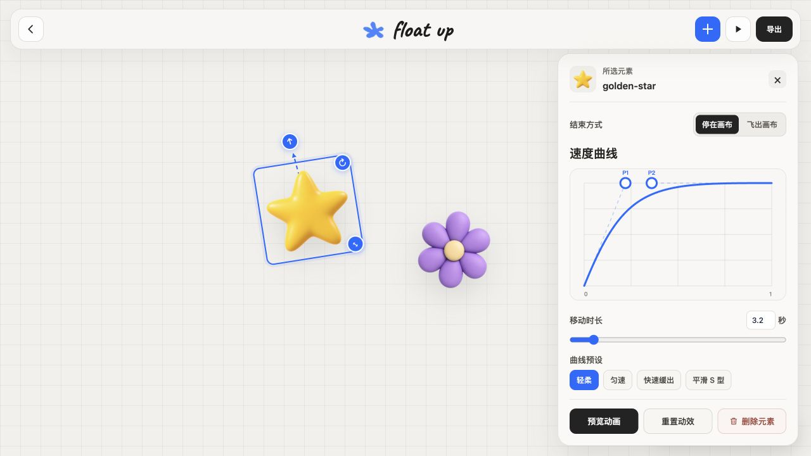

  

<h1 align="center">Float Up</h1>

  可视化制作图片动效，导出可直接嵌入网站的组件。 
  A visual editor for image motion, with a website-ready export.

  <a href="https://saisai-me.github.io/float-up/">在线体验 · Live demo</a>
  &nbsp;·&nbsp;
  <a href="README.en.md">English README</a>
  &nbsp;·&nbsp;
  <a href="#界面--screens">界面预览</a>
  &nbsp;·&nbsp;
  <a href="#快速开始--quick-start">快速开始</a>
  &nbsp;·&nbsp;
  <a href="LICENSE">MIT License</a>

## 界面 / Screens

| 01 · 介绍页 / Introduction | 02 · 编辑工作区 / Editor |
| :---: | :---: |
|  |  |

介绍页展示持续上浮的透明插画。进入工作区后，直接在画布上选择图片；右侧面板负责精确调整动效。点击顶栏播放图标即可在原画布预览整组动画。

The introduction shows a looping field of floating illustrations. In the editor, select images directly on the canvas, tune motion in the inspector, and preview the full scene with the play button.

## 能做什么 / Features

| | |
| --- | --- |
| **直接编辑** | 添加或拖入透明、不透明图片；在画布上移动元素，并用周围的控件调整方向、旋转和尺寸。 |
| **定义动效** | 为每个元素设置时长、单向速度曲线，以及停在画布或持续飞出的结束方式。 |
| **即时预览** | 单独播放选中元素，或点击顶栏播放按钮预览完整场景；播放后自动返回编辑画布。 |
| **带走作品** | 导出透明背景的网页组件、可再次编辑的 JSON、图片素材和给 Agent 的接入说明。 |

图片仅在浏览器本地处理，不会上传。编辑器会自动将素材和动效参数保存到当前浏览器的 IndexedDB，关闭或刷新页面后可继续编辑；清除站点数据会删除草稿。网站面向桌面端，编辑器接受浏览器可解码的图片格式；少见格式会转为 PNG 用于导出。运行时尊重 `prefers-reduced-motion`。

## 快速开始 / Quick start

1. 打开[在线编辑器](https://saisai-me.github.io/float-up/)，点击 **开始制作**。
2. 用 **＋** 添加图片，选择元素调整动效，点击播放图标预览。
3. 点击 **导出**，在弹窗中确认效果并下载 `float-up-website.zip`。
4. 将包内的 `float-up.js` 放入网站，按包内 `README.md` 的代码嵌入。运行时无需 React 或 npm。

继续编辑时，用 **＋** 选择导出的 ZIP，也可以把 ZIP 直接拖到画布上。JSON 与对应图片一起导入也可以。

### 导出包里有什么 / Export contents

| 文件 | 用途 |
| --- | --- |
| `float-up.js` | 图片已内嵌的独立 Web Component；网站运行时只需要这个文件。 |
| `float-up-layout.json` | 元素位置、尺寸、方向、速度曲线和结束方式。 |
| `ornaments/` | 图片素材，便于后续修改；少见格式以 PNG 保存。 |
| `README.md` | 可直接复制的接入代码与播放方式。 |
| `AGENTS.md` | 给编程 Agent 的文件说明和集成步骤。 |
| `LICENSE.txt` | 导出运行时代码的 MIT 许可证。 |

## 其他接入方式

如果使用 React，可参考 [React API 文档](docs/react-api.md) 直接集成动效组件。想改进 Float Up，可阅读[贡献指南](CONTRIBUTING.md)。

## 素材与许可 / Credits

代码和 `public/demo/` 示例素材使用 [MIT License](LICENSE)。首页循环插画来自 Microsoft Fluent Emoji，保留其 [MIT 授权与来源](public/landing/SOURCE.md)。用户上传图片的权利仍归用户所有。
